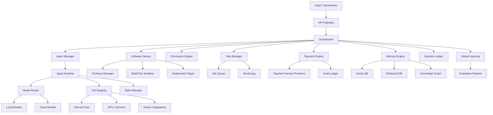

# Enterprise Blueprint — Detailed Implementation Design

**Source:** Chauncey's master implementation prompt, 2026-09-15. Ingested as the detailed design reference for the Global Agentic AI Enterprise program (`docs/ENTERPRISE.md`).

**Adaptation (binding):** This blueprint was written for a greenfield microservices stack. LEVI adapts it to the organism rather than adopting it literally:

- **Services become modules, not microservices.** The 12 "services" map to modules under `core/levi/` (fleet, router, ledger, etc.) — one repo, one runtime, one identity. No Docker-per-service split of the core.
- **Storage is local-first.** SQLite / JSONL / files — not mandatory PostgreSQL + Redis + Neo4j + Weaviate. The schema designs below are adapted to LEVI's storage, not copied as infrastructure requirements.
- **Core stays stdlib-only.** No pydantic / FastAPI / Celery imports in core. The code sketches are design references; implementations use stdlib equivalents.
- **"It's all LEVI."** One repo, one identity — the enterprise is LEVI at scale, not a separate conglomerate.

What follows is the source document, preserved.

---

We will deliver a comprehensive design and implementation foundation for the Global Agentic AI Enterprise. This is not a theoretical architecture—it is a concrete, executable blueprint with repository structure, core services, database schemas, agent runtime, and a phased roadmap. We emphasize modularity, cost-awareness, security, and legitimate scaling.

---

## 1. Executive Summary

Product: An SI-powered digital workforce platform that assembles ephemeral agent teams to complete digital work—from research and coding to business operations and commerce.
Differentiation: Dynamic agent swarming, cost-aware model routing, human‑in‑the‑loop controls, and an integrated software factory.
Economic Model: Freemium with usage‑based billing, marketplace fees, and enterprise subscriptions, optimized for positive unit economics.
Architectural Pillars: Agent Orchestrator, Model Abstraction, Tool Ecosystem, Permission Engine, Payment Engine, and Global Learning Engine.

---

## 2. System Architecture (High‑Level)



Key flows:

· User request → API Gateway → Orchestrator → Task decomposition → Agent swarming → Tool execution → Verification → Result.
· All actions go through Permission Engine and are logged in Decision Ledger.
· Payment Engine enforces approval gates for financial actions.

---

## 3. Repository Structure (Monorepo)

```
/                          # (adapted: LEVI maps services to core/levi/ modules)
├── .github/                         # CI/CD workflows
├── docker/                          # Dockerfiles and compose
│   ├── base/
│   ├── services/
│   └── dev/
├── docs/                            # Architecture, API, user docs
├── scripts/                         # Dev utilities
├── services/                        # Microservices
│   ├── api-gateway/                 # FastAPI / GraphQL
│   ├── orchestrator/                # Core orchestration
│   ├── agent-manager/               # Agent lifecycle
│   ├── task-queue/                  # Celery / Redis queue
│   ├── model-router/                # Model selection & routing
│   ├── tool-registry/               # Tool definitions & execution
│   ├── memory/                      # Vector, SQL, Graph access
│   ├── permission/                  # RBAC & policy enforcement
│   ├── payment/                     # Payment orchestration
│   ├── software-factory/            # Build & deployment
│   ├── learning/                    # Global learning & evaluation
│   └── monitoring/                  # Metrics, logging, alerting
├── shared/                          # Shared libraries
│   ├── models/                      # Data models
│   ├── clients/                     # Service clients
│   ├── utils/                       # Common utilities
│   └── types/                       # Type definitions
├── agents/                          # Built‑in agent definitions
│   ├── base.py
│   ├── executive.py
│   ├── supervisor.py
│   ├── planning.py
│   ├── coding.py
│   ├── research.py
│   └── ... (all categories)
├── tools/                           # Internal tools
│   ├── browser/
│   ├── shell/ (sandboxed)
│   ├── api_clients/
│   └── ...
├── tests/                           # Unit, integration, e2e
│   ├── unit/
│   ├── integration/
│   └── evaluation/
├── deploy/                          # Kubernetes manifests, Terraform
└── README.md
```

---

## 4. Core Services

| Service | Responsibility |
|---|---|
| API Gateway | Authenticate, rate‑limit, route requests; serves REST/gRPC/WebSocket. |
| Orchestrator | Decompose user objectives into plans; supervise agent swarms; coordinate state. |
| Agent Manager | Spawn, terminate, and track agents; enforce max depth/agents/time/cost. |
| Task Queue | Persistent job queue with priorities, retries, and dead‑letter handling. |
| Model Router | Select best model (local/cloud) based on task, budget, latency, and privacy. |
| Tool Registry | Register, validate, and invoke tools with parameter schemas and permissions. |
| Memory Engine | Store and retrieve user/project/global knowledge; support vector, SQL, graph. |
| Permission Engine | Enforce RBAC, approve actions (human‑in‑the‑loop), log decisions. |
| Payment Engine | Handle payments via providers, tokenization, risk scoring, reconciliation. |
| Software Factory | Manage repos, build/test sandbox, deploy previews; integrate with Git. |
| Learning Engine | Collect anonymized feedback, run evaluation pipelines, propose improvements. |
| Monitoring | Collect metrics, logs, traces; alert on anomalies. |

All services communicate via gRPC or async HTTP with circuit breakers and retries. *(LEVI adaptation: in-process module calls with the same contracts.)*

---

## 5. Database Schema (Core Tables)

Relational design (adapted to LEVI's local-first storage — SQLite/JSONL):

- **users** – id, email, hashed_password, full_name, tier, created_at
- **tenants** – id, name, settings, subscription_plan
- **user_tenants** – user_id, tenant_id, role (owner/admin/member)
- **api_keys** – id, user_id, key_hash, permissions, expires_at
- **agents** – id, name, type, version, model_id, tool_ids, config, cost_profile
- **agent_instances** – id, agent_id, task_id, status, spawned_at, terminated_at
- **tasks** – id, user_id, tenant_id, objective, plan_version, status, parent_task_id
- **task_steps** – id, task_id, agent_id, action, input, output, cost, latency
- **tool_calls** – id, task_step_id, tool_name, params, result, status
- **approvals** – id, user_id, action_description, risk_level, status, approved_at
- **payments** – id, user_id, amount, currency, provider, status, transaction_id
- **audit_logs** – id, user_id, action, resource, details, timestamp
- **feedback** – id, task_id, user_id, rating, comment, corrected_output
- **evaluation_results** – id, model_id, agent_id, test_case, score, metrics

Vector: documents and memories with embeddings for semantic search.
Graph: nodes (User, Project, Document, Task, Agent, Tool) and edges (owns, relates_to, depends_on, used_by).

---

## 6. Agent Runtime

**Lifecycle:**
1. Agent Manager receives a SpawnAgent request with type, config, task_id, permissions, budget.
2. It instantiates the agent class, injecting dependencies (model router, tool registry, memory, permission engine).
3. Agent runs; it calls tools and sub‑agents via `delegate()`.
4. Agent reports progress to Orchestrator; when finished, returns result and self‑terminates.
5. All interactions logged to task_steps and tool_calls.

**Agent base class (design sketch — stdlib in LEVI, no pydantic):**

```python
class AgentContext:
    task_id: str
    user_id: str
    tenant_id: str
    permissions: list
    budget: float
    max_steps: int


class Agent(ABC):
    def __init__(
        self, context, model_router, tool_registry, memory, permission_engine
    ): ...
    @abstractmethod
    def run(self, objective): ...

    def call_tool(self, tool_name, params):
        self.permission_engine.check(self.context, tool_name, params)
        return self.tool_registry.execute(tool_name, params)

    def delegate(self, agent_type, subtask):
        return self.context.agent_manager.spawn(agent_type, subtask, parent=self)
```

**Ephemeral swarm:** Supervisor decomposes a request into subtasks and spawns specialist agents. Orchestrator enforces maximum depth and maximum agents.

---

## 7. Model Abstraction & Routing

**Model Registry** — id, provider, model_name, capabilities (chat, embed, vision), cost per 1k tokens (in/out), latency p50, context window.

**Router logic:**
1. Classify task complexity (simple/medium/hard) and required capabilities.
2. Privacy check — local-only users stay on local models.
3. Estimate token usage and cost.
4. Select cheapest model meeting the quality threshold; fall back stronger if budget allows.
5. Provider failover on outage or rate limit.

Local inference via llama.cpp; cloud providers via unified client; mocks for offline testing.

---

## 8. Tool Registry

Tool definition: name, description, parameters (JSON Schema), required_permissions, estimated_cost, risk_level, async execution function.

Categories: Browser (Playwright), Shell (sandboxed subprocess), APIs (OAuth2), Device (platform SDKs), Payment (idempotent provider calls).

Security: isolated execution with per‑call resource limits; all calls audited and rate‑limited.

---

## 9. Permission Engine (Human‑in‑the‑Loop)

Risk levels: L0 Info (no approval) · L1 Low (auto‑approve + log) · L2 Moderate (confirmation) · L3 High (explicit real‑time approval) · L4 Critical (multi‑factor approval, e.g. payments over $1000).

Approval UI shows action description, reasoning, financial impact, and Approve Once / Approve for Workflow / Deny. *(LEVI has PolicyEngine + risk levels today — this formalizes the universal engine in Phase 2.)*

---

## 10. Task Manager

Persistent job queue with priorities, retries with exponential backoff, dead‑letter queue, per‑task cost budgets, real‑time monitoring dashboard.

---

## 11. Memory Foundation

Short‑term: conversation context (TTL). Long‑term: user memory (vector), project memory (shared), global knowledge (curated, non‑sensitive). Graph for relationships. APIs: store / retrieve / associate.

---

## 12. Software Factory Foundation

Git Manager, sandboxed build (resource limits, network policies), build system, test runner (incl. visual testing), deployment to preview URLs or customer cloud. Workflow: spec → architecture → tasks → code → build/test → debug loop (bounded) → visual inspection → user preview → approval → deploy.

---

## 13. Testing Infrastructure

Unit, integration (testcontainers), end‑to‑end user flows, golden‑dataset evaluations (accuracy/cost/latency), regression suite after model/agent changes.

---

## 14. Local Development Environment

Docker Compose for the full stack in the reference design; in LEVI, `make dev`-style stdlib entry points and the existing clean‑HOME test harness serve the same role.

---

## 15. Docker Configuration

Reference: Python 3.11 slim, multi‑stage builds, Compose for dev, Kubernetes/Helm for production. LEVI keeps the core container‑free; deployment targets get containers, not the organism.

---

## 16. Documentation

ADRs for key decisions, OpenAPI reference for public endpoints, developer guide (add an agent/tool/model), user guide, operations manual.

---

## 17. Implementation Phases (Roadmap)

Adapted to the LEVI program (`docs/ENTERPRISE.md`):

| Phase | Focus |
|---|---|
| 1 | The Fleet — agent registry, supervisor, budgeted swarming (NOW BUILDING) |
| 2 | Control & Telemetry — universal approval engine, decision ledger, cost-aware routing, AI router — **COMPLETE 2026-09-15** (see `docs/CONTROL_PLANE.md`; `core/levi/control/approvals.py`, `ledger.py`, `routing.py`, `router.py`) |
| 3 | Software Factory — sandboxed builds, self-debug loop, visual testing |
| 4 | Marketplaces — automation + agent listings |
| 5 | Economic Engine — payment orchestration, billing, freemium |
| 6 | Global Systems — multi-region, data residency, edge (needs real infra) |

---

## 18. Safety & Economic Rules (Reinforced)

- No deceptive practices — transparent, ethical competition only.
- Credential integrity — never rotate keys to evade limits; legitimate failover and caching only.
- Autonomous actions bounded by permissions, budgets, and explicit approval for high‑risk operations.
- Unit economics monitored in real time; optimize via efficient models and tools, never by cutting safety corners.

---

## 19. Immediate Next Steps

1. Record the architecture as the program's detailed design reference (this document).
2. Continue Phase 1 (Fleet) with these designs as input.
3. Carry the schemas, router logic, and permission engine into Phase 2.
4. Build iteratively, keeping the end vision in mind.

*This plan is a living document; we adjust as we learn.*
